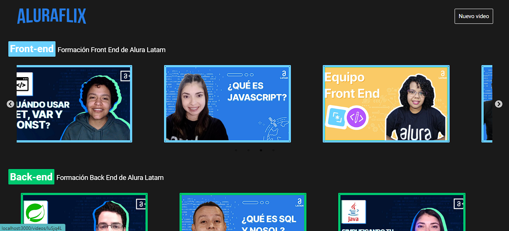
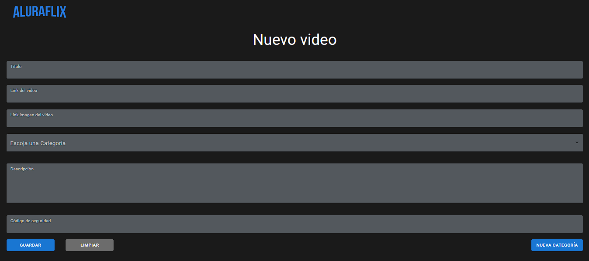
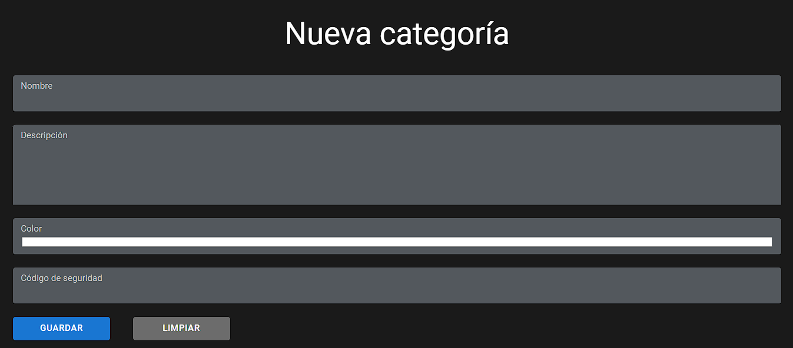
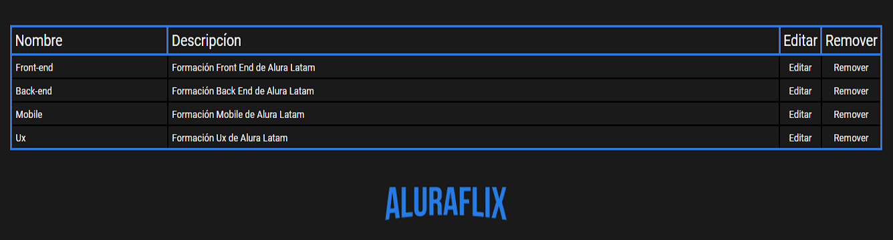

# Aluraflix

Aluraflix es una plataforma inspirada en Netflix, pero orientada específicamente hacia el contenido educativo proporcionado por Alura. Este proyecto tiene como objetivo ofrecer a los usuarios recomendaciones de videos basadas en sus intereses educativos, al tiempo que les permite agregar nuevas categorías y videos a la plataforma.

## Características

- • Recomendaciones personalizadas: Aluraflix utiliza algoritmos de recomendación para sugerir videos relevantes a los usuarios, basados en sus preferencias y actividades anteriores en la plataforma.
- • Exploración de categorías: Los usuarios pueden explorar diversas categorías de contenido educativo, como programación, diseño, marketing, entre otros, para descubrir nuevos videos de su interés.
- • Agregar nuevas categorías: Los usuarios tienen la capacidad de agregar nuevas categorías de contenido, lo que permite una mayor diversidad y adaptabilidad de la plataforma.
- • Contribución de videos: Los usuarios pueden contribuir a la plataforma agregando nuevos videos relacionados con los temas educativos existentes o en categorías recién creadas.

## Instalación

1.	Clona el repositorio de Aluraflix:
git clone <URL_DEL_REPOSITORIO>
2.	Navega hasta el directorio del proyecto:
    cd aluraflix
3.	Instala las dependencias necesarias utilizando npm (asegúrate de tener npm instalado):
    npm install
4.	A continuación, se listarán las dependencias principales que se utilizan en el proyecto:
- •	axios: Una biblioteca para hacer solicitudes HTTP desde el cliente.
- •	formik: Una biblioteca para facilitar la gestión de formularios en React.
- •	nanoid: Una biblioteca para generar identificadores únicos.
- •	react-player: Un reproductor multimedia para reproducir videos en React.
- •	react-router-dom: Una biblioteca de enrutamiento para la navegación en una aplicación      React.
- •	slick-carousel: Una biblioteca de carrusel para crear carruseles de imágenes y contenido.
- •	styled-components: Una biblioteca que permite escribir estilos CSS dentro de componentes de React.
- •	sweetalert2: Una biblioteca para mostrar alertas y modales interactivos.
- •	@mui/material: La biblioteca de componentes de Material-UI para React.
- •	Json-server: crea un api rest falsa para front-end que necesitan un back-end rápido para crear prototipos y simulacros.

Asegúrate de que estas dependencias estén correctamente instaladas y actualizadas en tu entorno de desarrollo.

## Uso

1.	Inicia la aplicación Aluraflix:
npm start
2.	Inicia api rest
json-server -w db.json –port 5000
3.	Abre tu navegador web y accede a http://localhost:3000 para cargar la página principal de Aluraflix.
4.	Navegación y exploración:
- • En la página principal, encontrarás una selección de videos educativos recomendados.
- • Utiliza la barra de navegación en la parte derecha para explorar diferentes categorías de contenido educativo, como programación, diseño, marketing, etc.
5.	Reproducción de videos:
- •	Para reproducir un video, haz clic  en su miniatura.
- •	El reproductor de video se abrirá y podrás disfrutar del contenido educativo.
    
6.	Agregar nuevos videos:
- •	Si deseas contribuir a Aluraflix y agregar nuevos videos relacionados con los temas existentes o en nuevas categorías, sigue estos pasos:
- •	Haz clic en el botón "Agregar Video" o una opción similar.
- •	Completa el formulario proporcionando la información del video, como título, descripción, URL y categoría.
- •	Envía el formulario para agregar el video a la plataforma.
    
7.	Agregar nueva categoría:
- •	Si deseas agregar una nueva categoría haz clic en el botón “nueva categoría”.
- •	Completa el formulario proporcionando la información de la categoría, como nombre descripción color.
    
8.	Editar y eliminar categorías
- •	En la parte inferior del formulario nueva categoría encontrara una tabla con las categorías existentes las cuales podrás eliminar o editar.
    
## Créditos

Alura: Agradecemos a Alura por proporcionar valiosos conocimientos en JavaScript, HTML, CSS y React a través de su plataforma educativa. Su contenido ha sido fundamental para el desarrollo de este proyecto.
Oracle: Agradecemos a Oracle por brindar recursos y documentación útil relacionados con tecnologías web como JavaScript y React. Su aporte ha sido invaluable en el proceso de construcción de Aluraflix.

## contacto

Si tienes alguna pregunta, comentario o sugerencia sobre Aluraflix, no dudes en contactarme:

- • Correo electrónico: [osfer8608@gmail.com](mailto:osfer8608@gmail.com)
- • GitHub: [feroscardona]( https://github.com/feroscardona)
- • linkedin: [oscar cardona]( linkedin.com/in/oscar-cardona-software)

